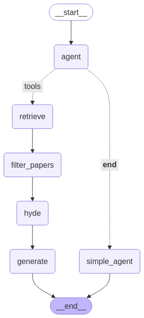

# Retrieval Augmented Generation (RAG) for Scientific Papers

## Setup
### VLLM Server
```
conda create -n vllm python=3.12
conda activate vllm
pip install vllm
```

### Client 
```
conda create -n rag python=3.12
conda activate rag
pip install -r requirements.txt
```

## Run
### Start VLLM Server

```
conda activate vllm
```
- Hermes-2-Pro-Llama-3-8B:  
    ```
    vllm serve NousResearch/Hermes-2-Pro-Llama-3-8B --chat-template tool_templates/tool_chat_template_hermes.jinja --enable-auto-tool-choice --tool-call-parser hermes
    ```
- Llama-3.1-8B-Instruct:
    ```
    vllm serve meta-llama/Llama-3.1-8B-Instruct --enable-auto-tool-choice --tool-call-parser llama3_json --chat-template tool_templates/tool_chat_template_llama3.1_json.jinja --max-model-len 40000
    ```
- Llama-3.1-70B-Instruct (on 8 GPUs):
    ```
    vllm serve meta-llama/Llama-3.1-70B-Instruct --enable-auto-tool-choice --tool-call-parser llama3_json --chat-template tool_templates/tool_chat_template_llama3.1_json.jinja --max-model-len 40000 --tensor-parallel-size 8
    ```

Tool templates for other models can be found at [VLLM Examples](https://github.com/vllm-project/vllm/tree/main/examples).

### Start Client
```
conda activate rag
python paper_rag.py --localhost --force_rag 
```
Arguments:
- `--api_base`: Address of vllm server, required if vllm is not hosted locally. Default: `http://134.2.17.206:8000/v1`
- `--localhost`: Set if vllm is hosted locally, overwrites `--api_base`.
- `--cache_dir`: Cache directory for huggingface model used for metadata extraction. Default: `cache`
- `--data_dir`: Data directory for dense vectorstore and sparse chunks. Default: `data`
- `--pdf_dir`: Directory containing the relevant papers as PDF, required if dense vectorstore and sparse chunks are not contained in data directory. Default: `data/pdfs`
- `--force_rag`: Set if RAG should be used for every user question.
- `--verbose`: Set for verbose RAG process.

## Workflow
### Without forcing RAG
Depending on the description of the tool description and the user question the LLM decides if RAG should be used. If not, a basic answer is generated without RAG.



### With forcing RAG
RAG is always used independent of the user question.


## Dense and Sparse Retriever
### On the first run
- The paper PDFs in `pdf_dir` are loaded as Documents, a LLM is used to extract metadata and the results are storerd in `data_dir`. 
- The papers are chunked and stored as dense vectorstores and sparse chunks in `data_dir`. 
- The dense vectorstores and sparse chunks are used by the dense and sparse retrievers in the RAG workflow.

### On the following runs
- The dense vectorstore and the sparse chunks are loaded from `data_dir`.
- The dense vectorstores and sparse chunks are used by the dense and sparse retrievers in the RAG workflow.


## Adjustment
- Edit the description of `retriever_papers_tool` in `paper_rag.py` to the research focus of the included publications to improve tool calling.
- Edit the HyDE message of the `hyde` function in `nodes.py` to the research focus of the included publications to improve the quality of HyDE retrievals.